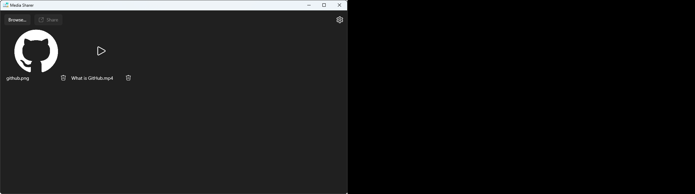
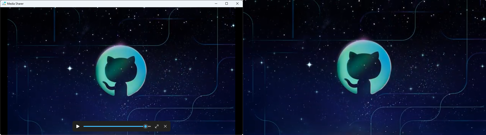

# Media Sharer

Media Sharer is a Windows desktop app that lets you project media on a second screen.

 

 

## How to get it ?
Download the latest package in the `Releases` section.

 

## But if you don't trust my package...
You can deploy it yourself, for that you have to :
- download sources
- install Visual Studio
- open the solution (`VISCACameraController.sln`)
- download and install necessary SDKs
- in the Solution Explorer, right-click the `VISCACameraController (Package)` project, choose `Publish` and click `Create App Packages...`
- select `Sideloading`, then click `Next`
- select `Yes, select a certificate`, then click `Create` and fill fields
- trust your new certificate, then click `Next`
- select the targeted CPU architecture and ensure `Solution Configuration` is `Release`
- finally click `Create` and after compiling find your package in the `Output location` folder